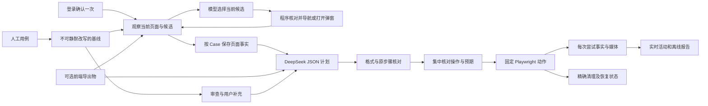

# 通用运行机制 · v0.3

唯一核心目标：把用例、执行与证据留在程序管理之下，模型负责受约束的审查、页面探索与规划。

业务差异来自每轮输入、页面和已核对计划，不通过核心内的业务分支适配。合成商品与任务站点位于独立 `demo.mjs`，不会参与真实用例解析或计划执行判断。

模型只能返回JSON，没有Shell、文件、数据库或浏览器执行工具。v2对Case/计划使用排序对象键的语义哈希，保留v1及文件字节哈希。确认预期分项后，计划必须覆盖全部分项且保留原步骤、文本、输入与路由；人工分项不能遗漏原文非标点内容。结构覆盖不等于自然语言业务语义证明，计划确认仍是必要分工。

登录确认后，普通导入任务在已有模型 Key、未执行用例及无待清理阻塞时自动启动探索。内置预制演示保留无需模型的体验。探索不依赖人工先走业务页面；未确认用例只采集，已确认用例探索后接入同一个控制器工作位置生成未批准计划。手动采集仅为补充入口。

模型每次只返回当前候选 ID、探索结束或具体阻塞理由。候选来自实际观察到的同源链接、菜单、页签、展开节点及查看/新建/编辑入口；禁止把提交、保存、删除、退出等作为探索动作。程序绑定固定元素，派发前重新检查唯一性、目标属性、文档与 URL，并在日志意图保存后再次核对。时钟和悬停提示等无关 DOM 变化不会使有效候选失效；目标真实变化则重新观察，再请模型选择。前端导出物只能补充绑定当前 Case 的已确认技术入口，不能改变业务预期或成为任意导航授权。

探索在保留原登录窗口的独立可见上下文运行，按只读请求规则拦截；跨域只读静态资源可加载，跨域导航和写请求受阻。每 Case 最多 12 次候选操作，整批最多 24 次探索模型调用、48 次浏览器动作、180 秒；自动规划包含在截止时间和原 100 次逻辑模型总上限内。循环、未知候选、取消、日志失败和超时都有明确结果，迟到计划不发布。按 Case 保存页面事实，界面展示当前 Case、操作目标、页面数及阶段，模型请求与探索操作留在诊断日志。探索完成不等于用例执行或产品验收。

会话由单一BrowserSession持有，准备与模型分析不重建登录窗口。认证只保存在进程内；执行前检查登录与前置，单独建立带录像的上下文。服务退出、浏览器关闭、服务端过期仍可能需要恢复登录。

只读Case中，动作尚未发出且定位不可见/不唯一时，最多请求两次单动作补丁。补丁含失败动作ID和旧定位哈希，新定位必须与批准的独立锚点指向同一个唯一元素。执行保持当前页面，不重放成功操作；使用固定ElementHandle派发，节点被替换时失败，不让动态Locator改指其他对象。文件I/O、断言、导航、已派发动作及清理失败均不进入模型修复。

每一步的断言共享截止时间和一次同步DOM读取；采集定位集合期间检查DOM变更序号，防止数量/对象来自不同状态。截止时间从最后动作完成开始，不因写日志延后；首次观测迟到是自动化观测失败，不能当成时限内满足或直接指控产品。协议不表达持续性、中间态或跨步骤时序。

写入可能已发生时，先按批准的只读观察检查已恢复状态和资源身份；身份未确认则不清理。清理动作的意图必须保存成功才能派发。清理失败锁住本任务后续业务，未知结果保留，正式复测使用新任务。当前没有跨任务数据影响锁或可证明完整的崩溃恢复；人工恢复记录也不等于程序重新验证。

每批固定所选Case、Case哈希和批准计划哈希。动作意图/结果先写不可覆盖事件文件并同步存储，再更新可变进度投影；最终事实封存事件链摘要、执行时的Case和计划。Windows文件提交只对文件操作重试。报告由校验后的事实汇总，投影冲突明确列出；媒体缺失仍可导出PARTIAL，业务、清理和证据互不替代。

控制器在第一个异步等待前预留工作位置，准备操作也互斥。模型返回后及提交时再次检查当前请求、取消状态和Case版本。关闭服务立即停止接收新工作，等待验证/准备/执行生命周期结束后释放数据目录实例锁。旧计划不继承v2批准。

可选Agent Lightning APO在独立进程优化规划补充提示，主协议与运行器固定。只用合成train/dev/holdout评估有效计划、正确阻塞及违规；候选在查看holdout前冻结，输出默认未启用。首次真实 DeepSeek 审查及规划已有阻塞记录；新版探索和第三方 APO 尚未真实联调，不能以模拟编排替代。现有 APO 入口不会自动训练或启用新的探索提示。

第一版是本地单用户工具，不引入多租户、队列服务、云发布或多Agent任务树。自动探索已覆盖本机标准 DOM 页面与弹窗场景；复杂控件和原生对话框能力后续依据真实失败样本再扩展，不在本轮承诺任意网站全自动覆盖。源码与最终证据见 [v0.3自动探索与验证](v0.3自动探索与验证.md)。
